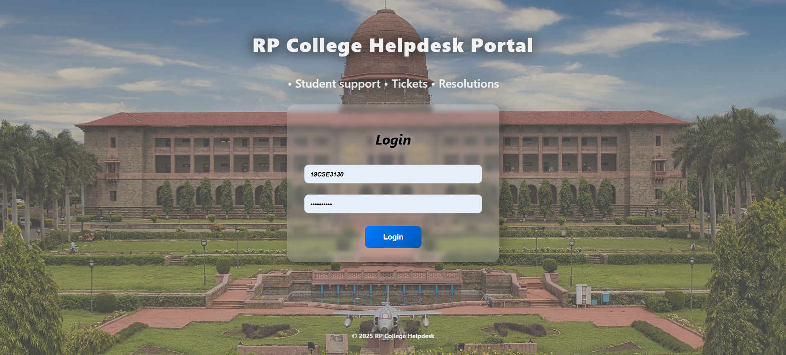
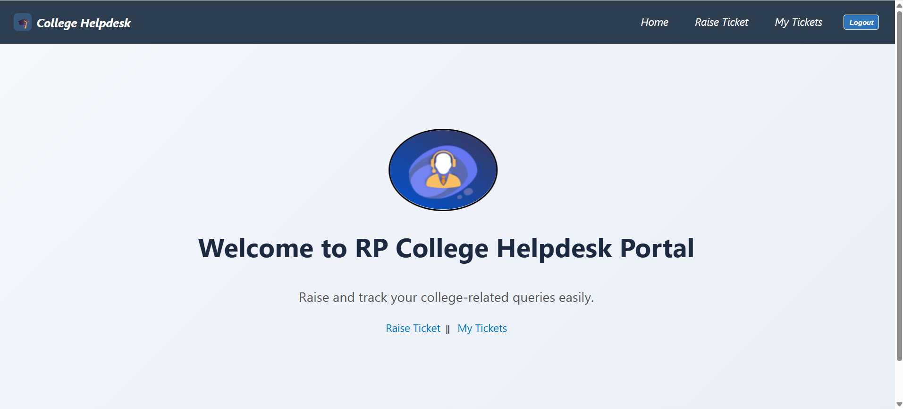
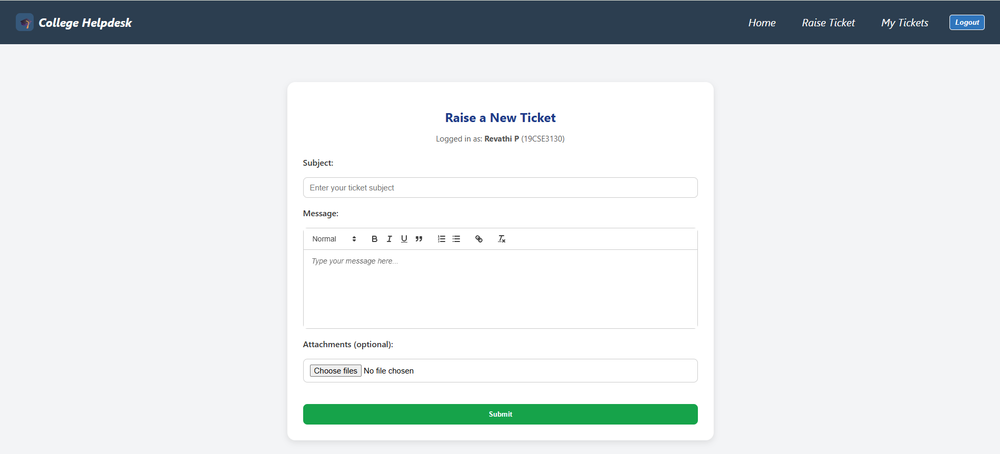
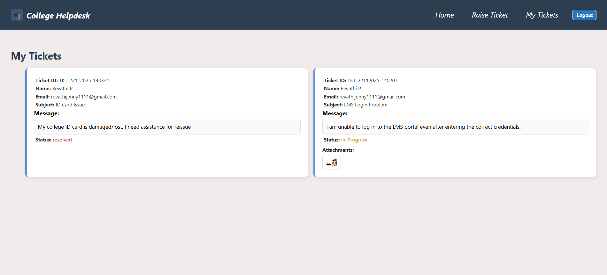
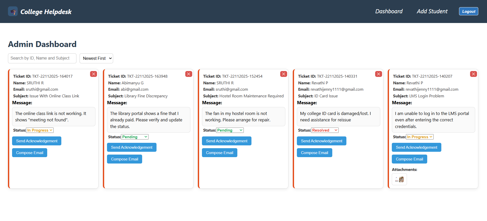
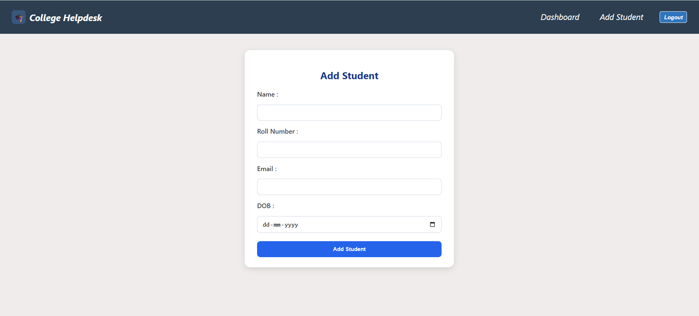

# College Helpdesk Portal – MERN Stack Application

The College Helpdesk Portal is a full-stack MERN application designed to streamline communication between students and college administration through a centralized ticketing system.

Students can raise support tickets related to academic or administrative issues, track their ticket status, and view responses, while administrators can manage, update, and resolve tickets through a dedicated admin dashboard.

The project implements role-based authentication, secure APIs, and a structured backend to simulate a real-world helpdesk system used in educational institutions.

---

## Key Features

### Student Module
- Secure login using roll number or email
- Raise support tickets with issue details
- View submitted tickets and their current status
- Role-based access control (student-only routes)

### Admin Module
- Secure admin login
- View all student tickets in a dashboard
- Update ticket status (Open / In Progress / Resolved)
- Add new students (admin-only functionality)
- Protected admin routes using JWT authentication

### General Features
- Role-based routing (student vs admin)
- JWT-based authentication and authorization
- RESTful API architecture
- Clean separation of frontend and backend
- Notification system for user feedback

---

## Tech Stack

### Frontend
- React.js
- React Router
- Context API
- CSS (custom styling)

### Backend
- Node.js
- Express.js
- MongoDB with Mongoose
- JWT Authentication
- bcrypt for password hashing

### Database
- MongoDB (Local Instance)

---

## Project Setup

### Backend
```bash
cd server
npm install
npm start
```

### Frontend
```bash
cd client
npm install
npm start
```

---

## 📷 Screenshots

### Login


### Student Dashboard


### Raise Ticket


### My Tickets


### Admin Dashboard


### Admin AddStudent



## Future Enhancements
- Deployment to cloud platform

---

## 👩‍💻 Author
**Revathi Savithiri**  
🌐 GitHub: [RevathiSavithiri](https://github.com/RevathiSavithiri)